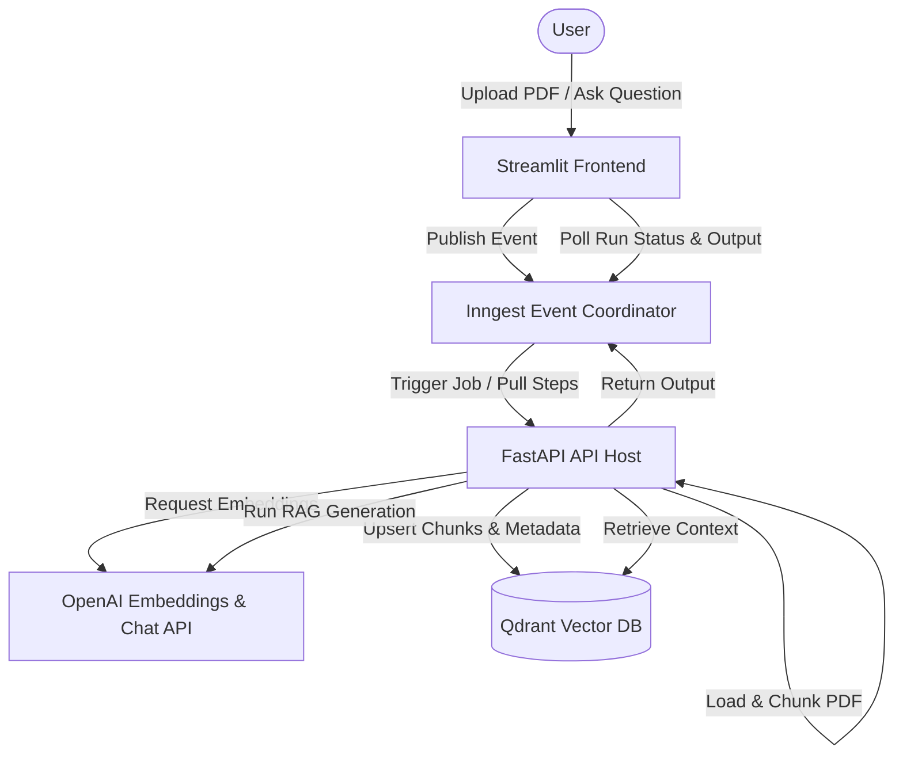

# Scalable Event-Driven PDF RAG Application

A production-grade, asynchronous Retrieval-Augmented Generation (RAG) platform designed to handle large-scale PDF ingestion, embedding generation, and semantic query capabilities.

Built using **FastAPI**, **Streamlit**, **Inngest** (for event-driven step-function orchestration), **Qdrant** (for vector storage), and **OpenAI**.

---

## 🏗️ Architecture Overview

The system is designed with an asynchronous microservice pattern to isolate compute-intensive steps (PDF parsing, text embedding, vector database writes, and LLM inference) from the user interface. This ensures a responsive frontend, resilient background job processing, and structured observability.



### Core Components
1. **Frontend (Streamlit)**: Offers a premium portal to upload PDFs and submit natural language questions. It operates asynchronously by publishing events to Inngest and polling execution state to output answers in real-time.
2. **Event Coordinator (Inngest)**: Serves as a zero-infrastructure queue managing task schedules, rate limits, throttles, and reliable state/step-level retries.
3. **API Server (FastAPI)**: Serves endpoints registering the Inngest runner functions, exposing logic for parsing documents, loading vectors, and executing queries.
4. **Vector Database (Qdrant)**: Storehouse for high-dimensional document vectors, configured to execute fast cosine similarity searches.

---

## 🚀 Installation & Setup Guide

Get the system up and running locally in minutes using `uv` (a fast Python package installer and resolver) and `Docker`.

### 1. Prerequisites
Ensure you have the following installed on your system:
- **Python 3.12+** (configured and run via `uv`)
- **Docker & Docker Compose**
- **Node.js** (for running the Inngest Dev Server local utility)

### 2. Configure Environment
Create a `.env` file in the root directory:
```env
OPENAI_API_KEY=your-openai-api-key-here
# Optional configuration:
INNGEST_API_BASE=http://127.0.0.1:8288/v1
```

### 3. Spin Up Qdrant Vector DB
Run a local instance of the Qdrant database:
```bash
docker run -d -p 6333:6333 -v "$(pwd)/qdrant_storage:/qdrant/storage" qdrant/qdrant
```

### 4. Run the Inngest Dev Server
Inngest orchestrates execution workflows locally:
```bash
npx inngest-cli@latest dev -u http://localhost:8000/api/inngest
```

### 5. Install Dependencies & Launch Backend
Synchronize requirements and start the FastAPI server:
```bash
# Sync dependencies
uv sync

# Launch FastAPI app on port 8000
uv run uvicorn src.main:app --host 127.0.0.1 --port 8000 --reload
```

### 6. Run the Frontend UI
Start the Streamlit application in a separate terminal:
```bash
uv run streamlit run frontend/streamlit_app.py
```

---

## 🔌 API & Event Reference

The core application workflows are executed asynchronously by sending events to the Inngest broker.

### 1. Ingest PDF Document
* **Event Name**: `rag/inngest_pdf`
* **Trigger Payload**:
  ```json
  {
    "name": "rag/inngest_pdf",
    "data": {
      "pdf_path": "c:/Users/aftab/OneDrive/Desktop/pora/github/scalable-pdf-rag-application/uploads/sample.pdf",
      "source_id": "sample.pdf"
    }
  }
  ```
* **Orchestrated Steps**:
  1. **`load-and-chunk`**: Parses pages using `PDFReader` and chunks semantic text blocks using `SentenceSplitter`.
  2. **`embed-and-upsert`**: Generates text embeddings using `text-embedding-3-large` (3072 dimensions) and writes them to Qdrant.
* **Throttling & Rate Limits**:
  - **Throttle**: Maximum of 10 executions per minute with a burst allowance of 2.
  - **Rate Limit**: Strictly limited to 1 execution per 4 hours per `source_id` to prevent redundant computations on identical files.

### 2. Query PDF using AI
* **Event Name**: `rag/query_pdf_ai`
* **Trigger Payload**:
  ```json
  {
    "name": "rag/query_pdf_ai",
    "data": {
      "question": "What is the primary system architecture outlined in the document?",
      "top_k": 5
    }
  }
  ```
* **Orchestrated Steps**:
  1. **`embed-and-search`**: Embeds the user question and runs a query against Qdrant to retrieve the top-k matches.
  2. **`llm-answer`**: Passes the retrieved context and question to OpenAI `gpt-4o-mini` using the Inngest AI Infer adapter.
* **Return Payload**:
  ```json
  {
    "answer": "The system architecture consists of a FastAPI backend and a Streamlit frontend...",
    "sources": ["sample.pdf"],
    "num_contexts": 5
  }
  ```

---

## 📈 Production Scalability & Reliability

This codebase is engineered to prevent common production bottlenecks when scaling RAG architectures:

### 1. Chunk-Batched Vector Ingestion Loop
Inserting large volumes of high-dimensional vectors (3072-d) sequentially causes excessive network overhead and slows database performance.
- We divide the upsert operation into manageable, parameterized batches (default `batch_size: int = 100`).
- This decreases load on Qdrant, minimizes API request payload limits, and speeds up the database ingestion loop.

```python
# From src/vector_db.py
def upsert(self, ids, vectors, payloads, batch_size: int = 100):
    for i in range(0, len(ids), batch_size):
        batch_ids = ids[i:i + batch_size]
        batch_vectors = vectors[i:i + batch_size]
        batch_payloads = payloads[i:i + batch_size]
        
        points = [
            PointStruct(id=batch_ids[j], vector=batch_vectors[j], payload=batch_payloads[j])
            for j in range(len(batch_ids))
        ]
        self.client.upsert(self.collection, points=points)
```

### 2. Step-Level Fault Isolation
Traditional script pipelines crash completely when a third-party API (OpenAI embeddings, Qdrant cluster) experiences transient network issues.
- Using **Inngest step orchestration**, each block is executed as a distinct transactions step.
- If Qdrant goes offline during the `embed-and-upsert` phase, only that step is retried. The parsed chunks from `load-and-chunk` are cached, saving compute time and API credits.

### 3. Rate-Limiting & Throttling
We prevent resource starvation and API rate-limit exhaustion by applying token-based throttles on PDF ingestion events.
- Reduces embedding API billing spikes.
- Prevents database thread pool locks.
